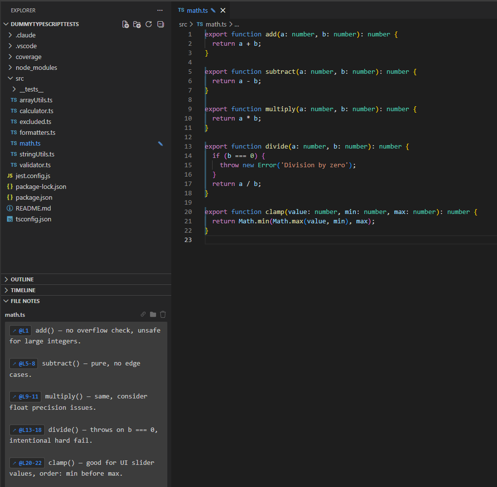
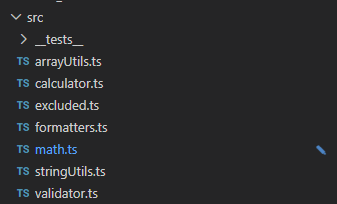
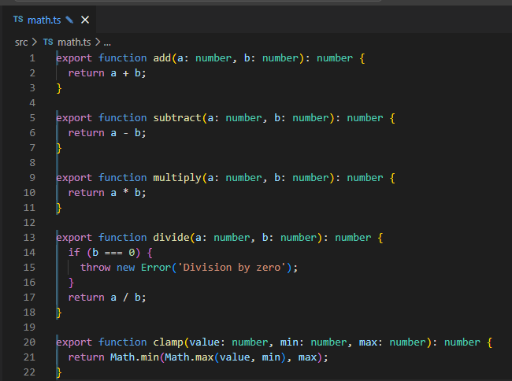

<div align="center">


# Filebound Notes

[](LICENSE)

</div>



---

## What it does

File Notes lets you attach a persistent note to any file in your workspace. Switch files — the note switches with you. No separate tabs, no extra windows. Everything stays inside the Explorer sidebar where you already work.

---

## Features

### 🔗 Line references

Write `@L42` or `@L13-18` anywhere in a note to pin it to a specific line or range. In view mode the reference renders as a clickable badge — click to jump directly to that line.

**Three ways to insert a reference:**

| Method | How |
|---|---|
| Type `@` in the note | IntelliSense dropdown lists all symbols in the current file. Filter by name, navigate with ↑↓, confirm with Enter or Tab. |
| ⛓ button in the panel header | Inserts `@L{n}` based on the active editor cursor or selection. |
| Right-click in the editor | **File Notes: Insert Line Reference** — works with multi-line selections too. |

### ✎ File-tree badges

Files with notes show a `✎` badge in the Explorer tree — no need to open a file to know it has annotations.



### 📌 Gutter indicators

Every line referenced in a note gets a colored left-border highlight and an overview-ruler mark — referenced code stays visible at a glance without opening the notes panel.



### 🔍 Notes search

`File Notes: Search Notes` opens a Quick Pick across all notes in the workspace. Filter by filename or note content and jump straight to the file.

### ⚡ Auto-save

Notes save automatically 500 ms after you stop typing. No save button, no lost work.

---

## Usage

1. Open any file in the editor.
2. The **FILE NOTES** panel appears at the bottom of the Explorer sidebar.
3. Click to edit — write your note, use `@L42` to reference lines.
4. Click elsewhere to switch to view mode with rendered badges.

### Panel header buttons

| Button | Action |
|---|---|
| ⛓ | Insert line reference at cursor position |
| 📁 | Open the notes storage file in the OS file explorer |
| 🗑 | Clear the note for the current file |

### Commands

Open the Command Palette (`Ctrl+Shift+P`) and search for:

- **File Notes: Search Notes** — full-text search across all notes
- **File Notes: Clear All Notes** — delete all notes after confirmation

---

## Installation

Search for **File Notes** in the VS Code Extensions view (`Ctrl+Shift+X`), or install with one command:

```
ext install mgrosshauser.filebound-notes
```

---

## Storage

Notes are stored in VS Code's own workspace storage — **outside your repository, never committed to git**, but persisted across sessions and unique to each workspace.

```json
{
  "src/index.ts": "Entry point. @L5-12 registers all commands.",
  "src/utils.ts": "Helper for @L23 — see issue #42."
}
```

When a file is renamed, moved, or deleted via the Explorer, its note is updated or removed automatically.

---

<div align="center">

MIT License · [GitHub](https://github.com/WalSplitter/filebound-notes-vscode)

</div>
