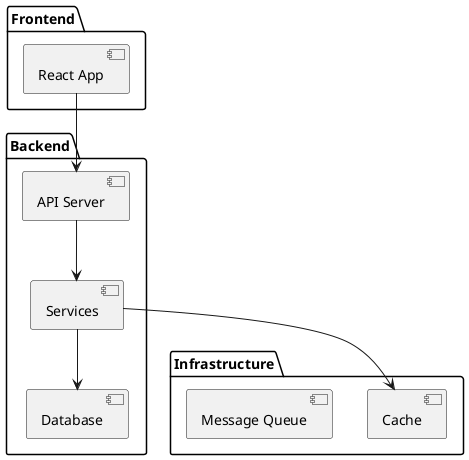

# Documentation

Dedicated directory for project documentation, guides, and architectural decisions.

## Directory Structure

```
docs/
├── getting-started.md         # Quick start guide
├── architecture.md            # System architecture
├── api/
│   ├── endpoints.md           # API reference
│   ├── authentication.md       # Auth documentation
│   └── errors.md              # Error handling
├── guides/
│   ├── development.md         # Development setup
│   ├── testing.md             # Testing guide
│   ├── deployment.md          # Deployment process
│   └── security.md            # Security guidelines
├── adr/                       # Architecture Decision Records
│   ├── 001-typescript.md
│   ├── 002-monorepo.md
│   └── 003-error-handling.md
├── troubleshooting.md         # Common issues and solutions
└── faq.md                     # Frequently asked questions
```

## Documentation Standards

### Markdown Formatting

```markdown
# Main Heading (H1)

## Section Heading (H2)

### Subsection (H3)

**Bold text** for emphasis
_Italic text_ for alternatives

- Bullet point
- Another point
  - Nested point

1. Numbered item
2. Another item

> Quote or important note

[Link text](url)


\`\`\`language
code block
\`\`\`

| Header 1 | Header 2 |
| -------- | -------- |
| Cell 1   | Cell 2   |
```

### File Naming

- Use lowercase with hyphens: `my-document.md`
- Be descriptive: `user-authentication-flow.md`
- Prefix ADRs: `001-decision-name.md`

## Documentation Types

### Getting Started Guide

```markdown
# Getting Started

## Prerequisites

- Node.js 18+
- npm or yarn
- Git

## Installation

1. Clone the repository
   \`\`\`bash
   git clone <url>
   cd project-name
   \`\`\`

2. Install dependencies
   \`\`\`bash
   npm install
   \`\`\`

3. Configure environment
   \`\`\`bash
   cp .env.example .env
   \`\`\`

4. Start development
   \`\`\`bash
   npm run dev
   \`\`\`

## Next Steps

- Read [Development Guide](guides/development.md)
- Check [API Documentation](api/endpoints.md)
- Review [Architecture](architecture.md)
```

### Architecture Documentation

```markdown
# System Architecture

## Overview

[High-level description]

## Components

### Frontend

- React application
- State management: Zustand
- API client: Axios

### Backend

- Node.js/Express
- Database: PostgreSQL
- Cache: Redis

## Data Flow

[Describe how data flows through system]

## Database Schema

[Include ER diagram]

## Deployment Architecture

[Infrastructure diagram]
```

### API Documentation

```markdown
# API Reference

## Authentication

All requests require Bearer token in Authorization header:
\`\`\`
Authorization: Bearer <token>
\`\`\`

## Endpoints

### GET /api/users/:id

Fetch user by ID.

**Parameters:**

- \`id\` (string, required) - User ID

**Response (200 OK):**
\`\`\`json
{
"id": "user-123",
"email": "user@example.com",
"name": "John Doe"
}
\`\`\`

**Errors:**

- \`404\` - User not found
- \`401\` - Unauthorized
```

### Architecture Decision Record (ADR)

```markdown
# ADR-001: Use TypeScript for All Projects

**Date:** 2026-05-31
**Status:** Accepted
**Context:** Build robust, maintainable applications with type safety

## Decision

We will use TypeScript for all new projects.

## Rationale

- Type safety catches errors at compile time
- Better IDE support and autocomplete
- Self-documenting code through types
- Popular ecosystem with mature tooling

## Consequences

- Positive: Fewer runtime errors, better developer experience
- Negative: Build step required, slightly longer development time
- Neutral: Requires team learning for TypeScript concepts

## Alternatives Considered

1. Flow - Less mature than TypeScript
2. No typing - Too error-prone for large projects

## Related Decisions

- ADR-002: Use ESLint for code quality
```

## Contributing to Documentation

### Guidelines

1. **Keep it current**: Update docs when code changes
2. **Be clear**: Write for developers unfamiliar with code
3. **Use examples**: Show how to use features
4. **Add visuals**: Use diagrams for complex flows
5. **Link related docs**: Cross-reference related topics

### Adding New Documentation

```markdown
# New Document

## For Feature Documentation

- What does it do?
- Why was it built?
- How to use it?
- Examples
- Related features

## For Architecture Docs

- Problem being solved
- Solution chosen
- Alternatives considered
- Trade-offs
- Implementation details

## For Troubleshooting

- Problem description
- Symptoms
- Root cause
- Solution
- Prevention
```

## Using Diagrams

### Markdown Diagrams

```markdown
\`\`\`mermaid
graph TD
A[User] -->|Login| B[Auth Service]
B -->|Token| C[API Gateway]
C -->|Request| D[Application]
D -->|Query| E[Database]
\`\`\`

\`\`\`mermaid
sequenceDiagram
participant Frontend
participant Backend
participant Database
Frontend->>Backend: POST /users
Backend->>Database: INSERT user
Database-->>Backend: Confirm
Backend-->>Frontend: User created
\`\`\`
```

### PlantUML Diagrams



## Common Documentation Scenarios

### Documenting an API Endpoint

1. Method and path
2. Authentication requirements
3. Request parameters/body
4. Response format (success and errors)
5. Code example
6. Rate limiting information
7. Related endpoints

### Documenting a Feature

1. Overview and purpose
2. How to enable/configure
3. Basic usage example
4. Advanced usage scenarios
5. Limitations or known issues
6. Related features
7. Troubleshooting tips

### Documenting Configuration

1. Environment variables needed
2. Format and valid values
3. Default values
4. Example configuration
5. Where to set values (CI/CD, Docker, etc.)
6. Validation rules

## Publishing Documentation

### Static Site Generation (Optional)

```bash
# Using VitePress
npm install -D vitepress
npx vitepress init

# Build and serve
npm run docs:build
npm run docs:serve
```

### GitHub Pages

```bash
# Add to GitHub Actions workflow
- name: Build docs
  run: npm run docs:build

- name: Deploy
  uses: peaceiris/actions-gh-pages@v3
  with:
    github_token: ${{ secrets.GITHUB_TOKEN }}
    publish_dir: ./docs/.vitepress/dist
```

## Documentation Checklist

Before considering documentation complete:

- [ ] Clear, concise title
- [ ] Target audience identified
- [ ] Examples provided
- [ ] Links to related docs
- [ ] Code examples tested
- [ ] Screenshots/diagrams included
- [ ] Typos checked
- [ ] Formatted consistently
- [ ] Cross-references updated
- [ ] Version number current

---

**Last Updated**: 2026  
**Version**: 1.0
